# Task 1

### Task 1a
1. Explicit intent and Implicit intent are the two types of intents.
2. Explicit intent is more secure.
3. This is an implicit intent.
4. This is an explicit intent.
5. ThirdFragment has the more secure technique for implementing an Intent.

### Task 1b
For this task we need to modify the file ```GiftcardSite/app/src/main/java/com/example/giftcardsite/SecondFragment.kt``` which has an implicit intent. We remove the implicit intent and add an explicit intent because explicit intents are more secure. We can see it in the screenshot below, the commented lines is the old intent and the new intend is highlighted. We specify the URI in the intent constructor while allows only browser to act on the intent.
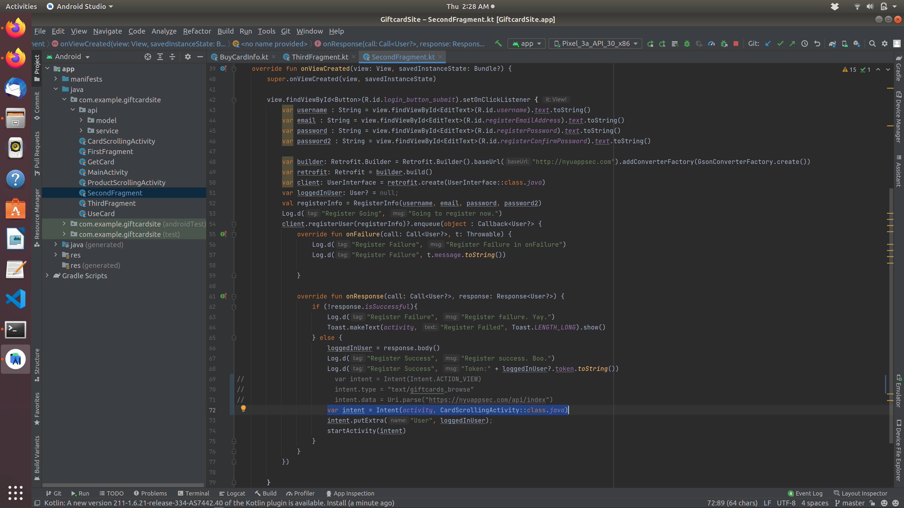

### Task 1c
For this task we need to remove the ```intent-filters``` that are present in the ```Android Manifest``` file under the activities ```UseCard```, ```GetCard```, ```ProductScrollingActivity``` and ```CardScrollingActivity```. This will prevent other applications including other applications written by the same developerto use Intents to launch Activities within the GiftCard application. In the screenshot we have commented out the lines that we need to remove.
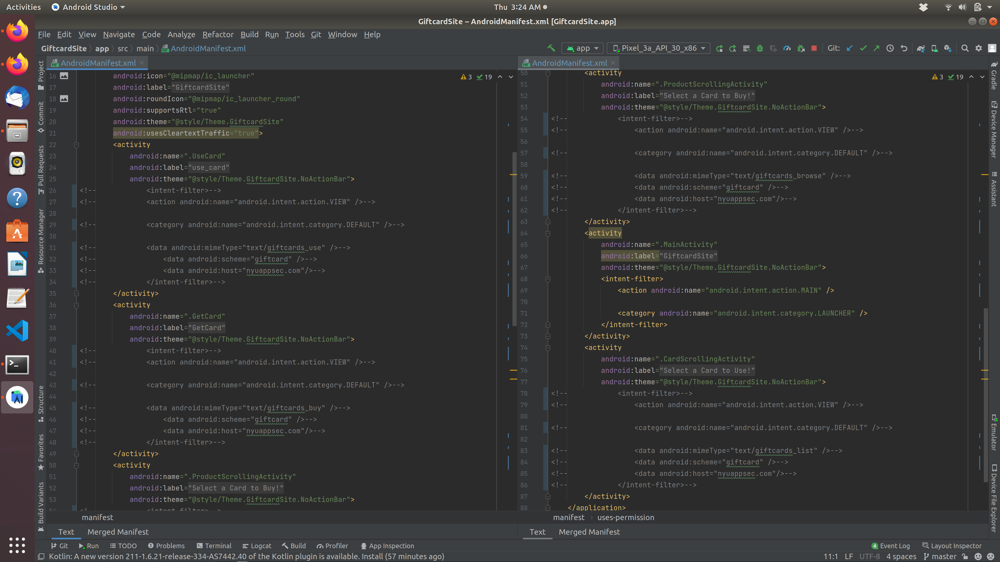

We have ensured the working of the app after the changes in the screenshot below.
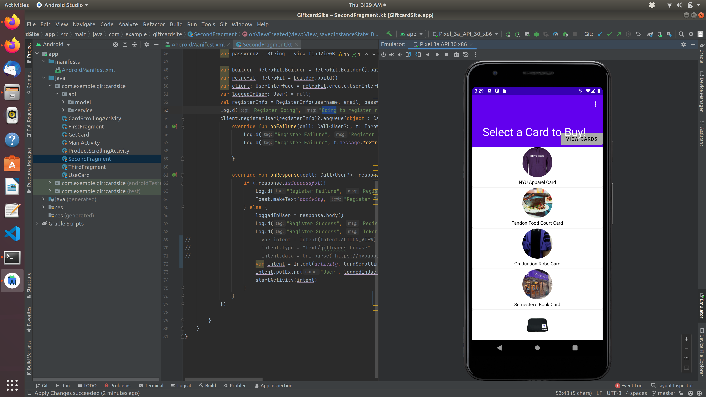


# Task 2

In order to secure all communication with the REST API using HTTPS, we need to modify the 8 files mentioned such that all the instances of ```http call``` is changed to ```https call```.
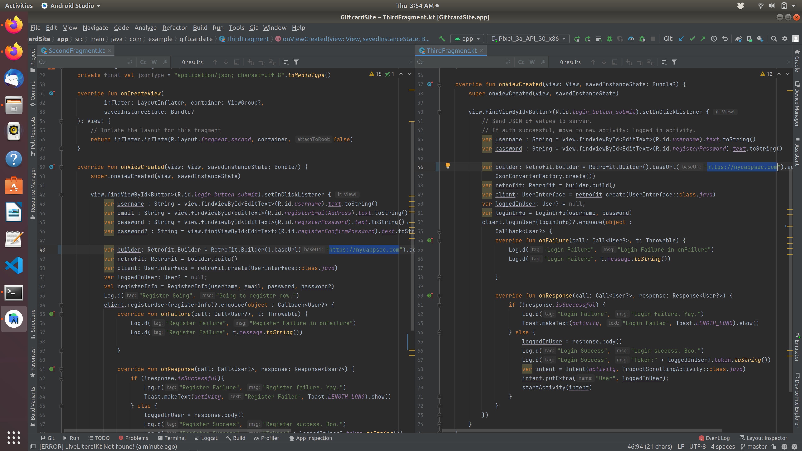

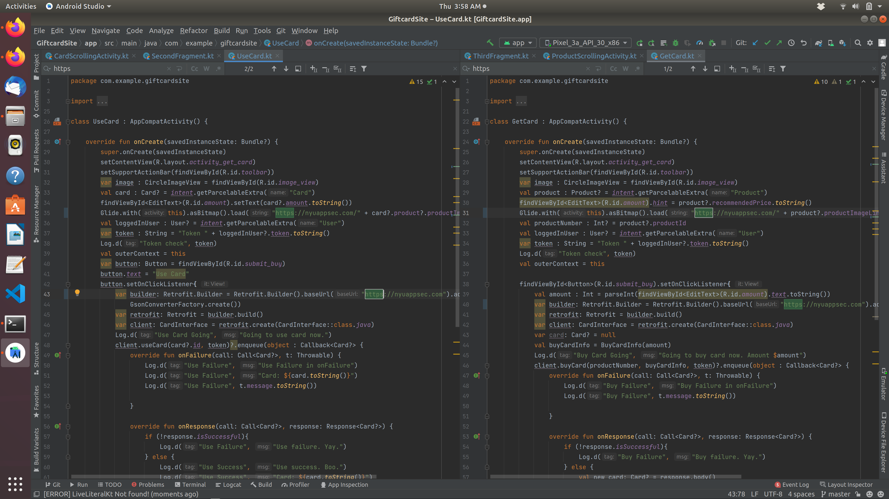
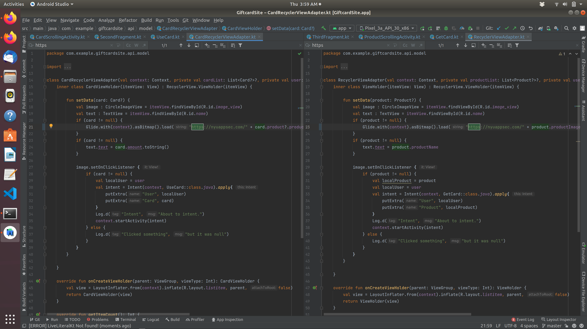
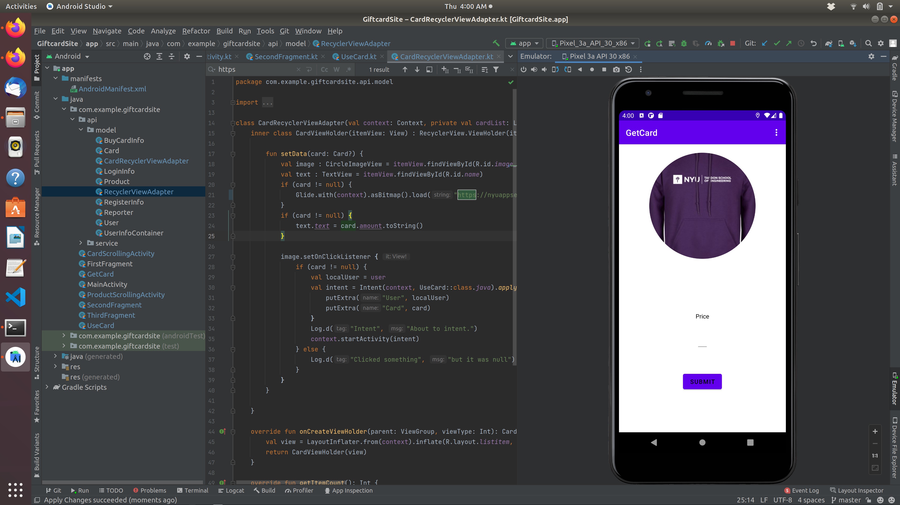

# Task 3

### Task 3a

In this task we need to exploit the authorization issue present in the api. We see that in the file ```CardInterface.kt```, the use card api takes the card number and token as the parameters. There is no authorization to check if the token is allowed to use that particular gift card. We follow the following steps.
1. We first register two users, victim and attacker and buy a gift card in the victim account.
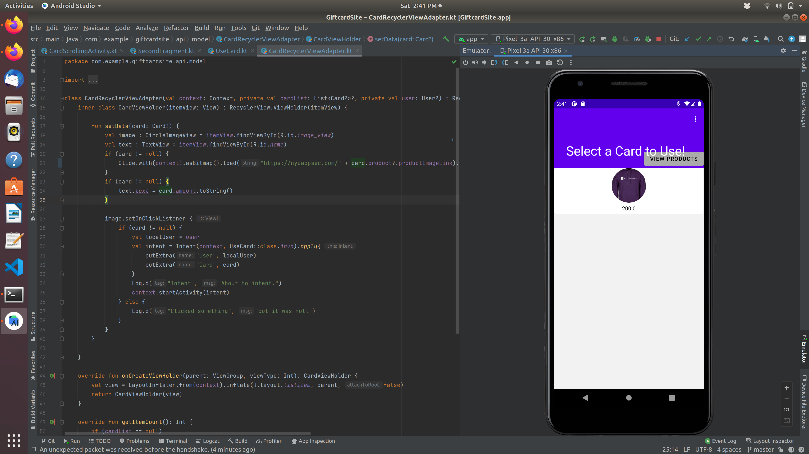
2. We then use the ```reqbin``` application to run the use card api to get the token of each user.
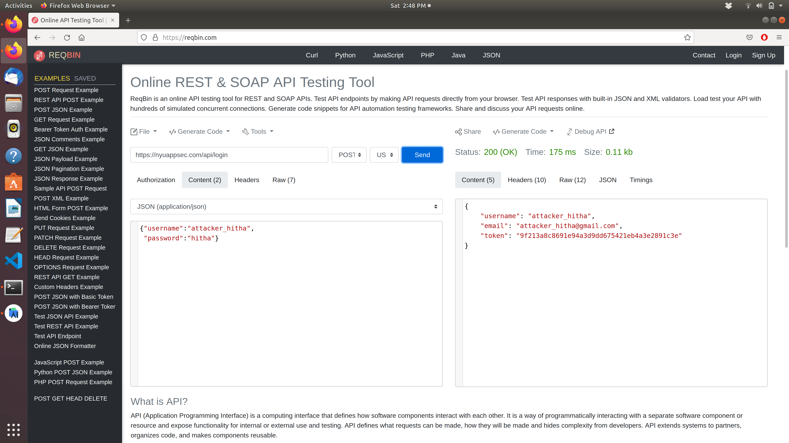
3. Then using the api https://nyuappsec.com/api/cards and the victim token, we find the gift card id that is bought in the mobile application.
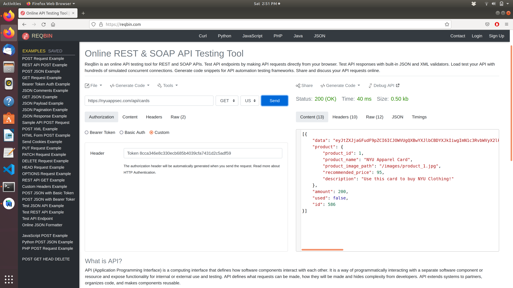
4. Now using https://nyuappsec.com/api/use/<card_id> api, we use the attacker token and the gift card of the victim by using the card id that we got from the previous step. We are able to use it successfully. To show this we login to the victim account and see that the card is no longer present.
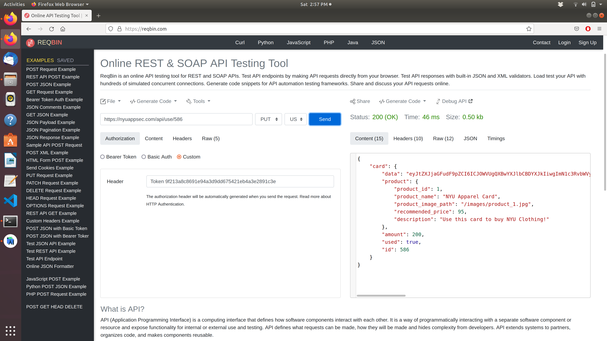
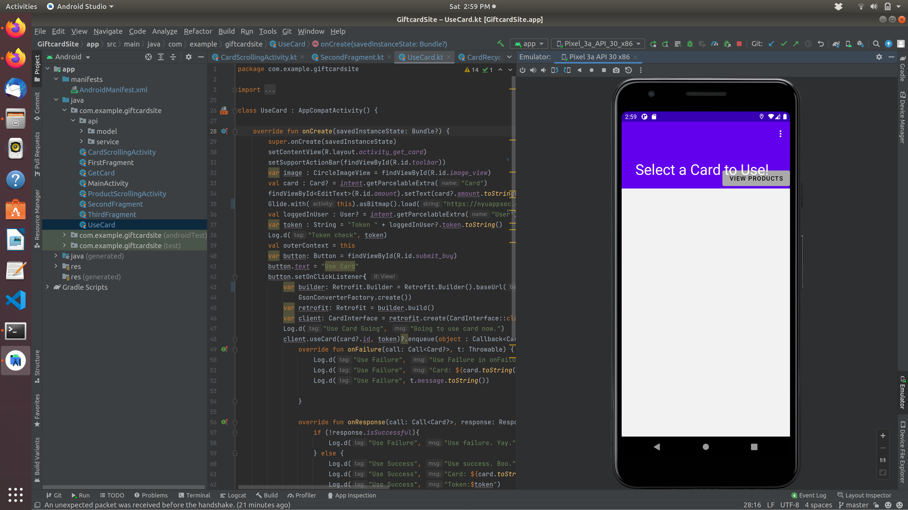


### Task 3b
The changes that can me made to prevent the use of other users' gift card are listed below:
1. Firstly the token of the user is so easily accessible using the api testing application. This needs to be prevented so the attacker would not be able to leverage the token for his uses. This can be done by ```encryption``` of the token on the server side.
2. There is no authorization of the token to see if the card belongs to the user. This can be done by creating a relation between the card and the user using a unique ```user id``` that maps the cards to the particular user and whenever the card is being used, there should be an authorization to check if the token and the card have the same user id. If this does not match the use of card can be terminated.
3. When the card is being used, there is no check if the card has already been used or not. This can be introduced in the database again by having a new attibute for instance ```used``` that might have the values true or false. If the card attribute used has the value false, then only the card must be used else it should fail.

# Task 4

### Task 4a
1. We first examine the file ```AndroidManifest.xml``` and see that it has the lines asking for permission from user for accessing the location and state of network which are not required for the functioning of the application. In the next steps we will examine the other files that leverage this data and modify them.
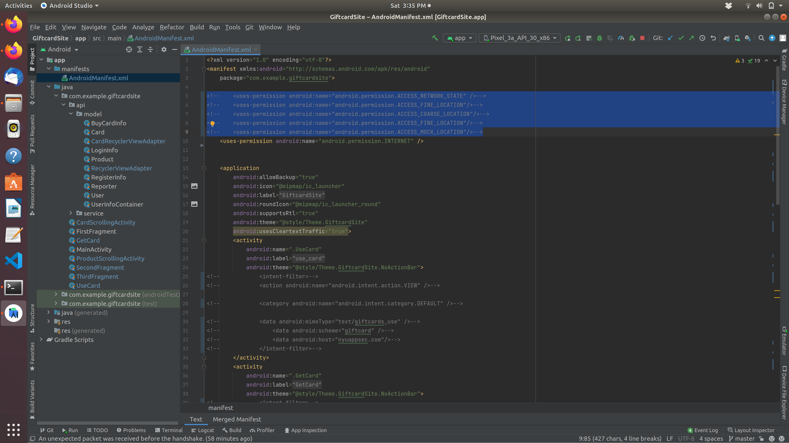
2. We then examine the file ``` CardScrollingActivity.kt``` and find that the LocationListener is used to set the location and track the user's location. We do some modifications so the user location is not accessed. We  remove the lines of code used to set the location manager.
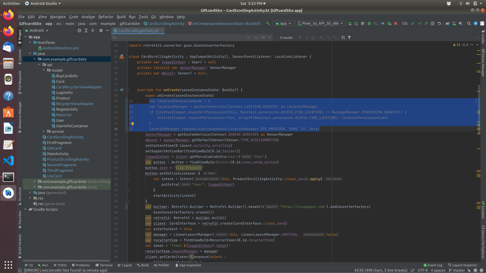
3. Similary in the file ```ProductScrollingActivity.kt```, LocationListener is used to set the location and track the user's location. So we do the changes that we did in the previous step again for this file.
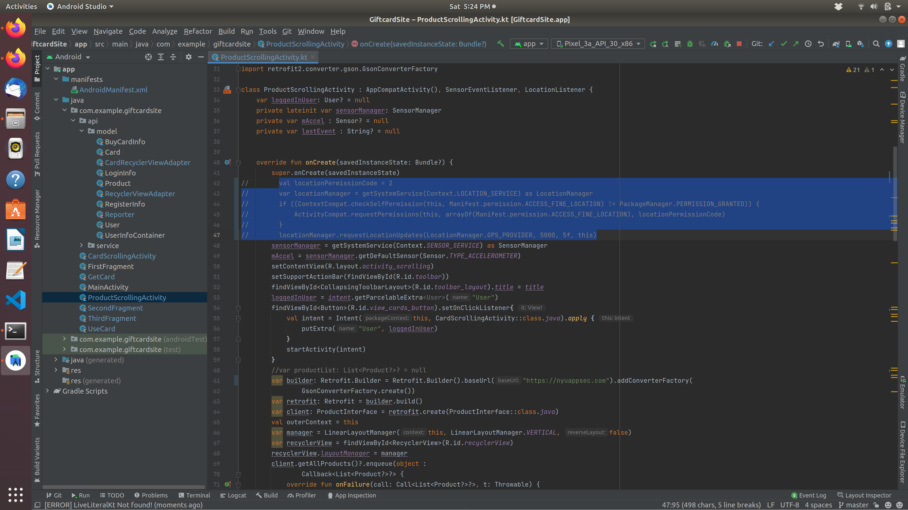


### Task 4b
1. We examine the file ```CardScrollingActivity.kt``` and see that the onLocationChanged method pushes user location to the metrics REST API. So we remove this method so that the metrics api does not collect any location information of the user. Then we remove the remaining useless lines of code such as import statements for location and the location manager. Then we modify the class defition to not use the LocationListener. We remove the onSensorChanged method that pushes the sensor information to the metrics api as these metrics are not required for the functioning of the giftcard application.
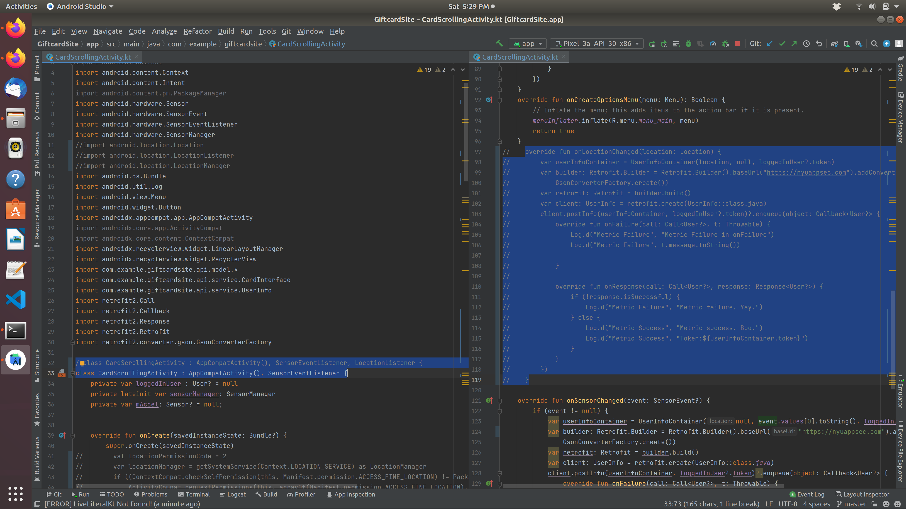
2. Then we examine the file ```ProductScrollingActivity.kt``` which is similar to the file CardScrollingActivity.kt. So we do the changes in step 1 to this file too.
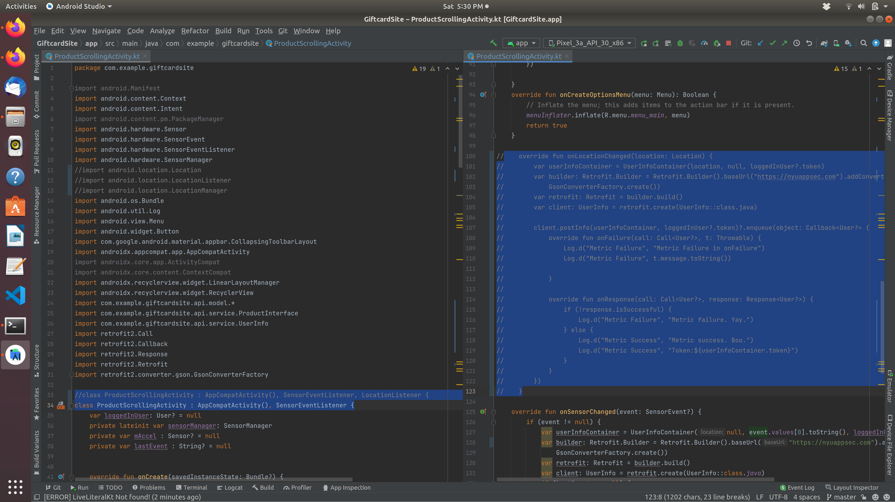
3.  We need to do the above changes in another file ```Reporter.kt``` that uses the location data of the client to push it to the REST API. So we remove the import statements, modify the class definition and remove the method that use or access the location information.
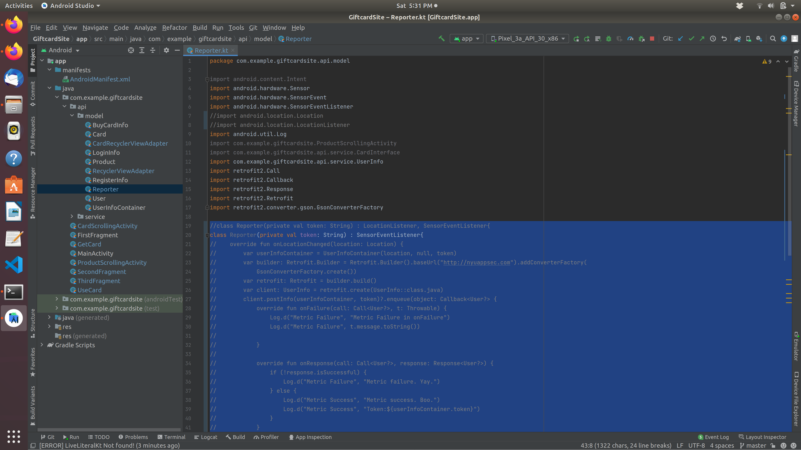

We do not remove the api call for pushing the sensor data to the metrics api yet because it is not containing any location data of the user.


### Task 4c
The Accelerometer sensor of the device is used in the mobile application and the sensor data is being collected as the metrics. This is not required for the functioning of the application. The following steps need to be followed to prevent the use of sensor usage in the application.
1. We examine the file ```UserInfoContainer.kt``` and see that the location and sensors are accessed. So we remove the import statements and modify the class definition to remove the location and sensor parameters.
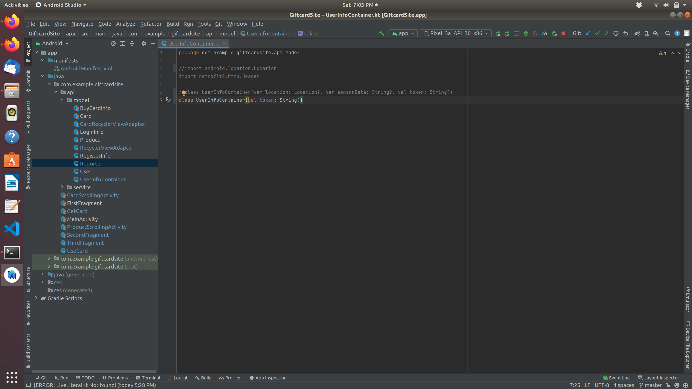
2. In the file ```CardScrollingActivity.kt```, we see that there are sensor references and usages. Firstly we need to remove the import statements for the sensor packages. Then we modify the class definition of CardScrollingActivity such that it does not contain the sensor listener. Then we remove the class variables that are used for accessing the sensor data and the code for sensor manager setting. Then we remove the methods ```onAccuracyChanged```, ```onResume```, ```onPause``` and ```onSensorChanged``` that either access or push the sensor data to the api metrics.
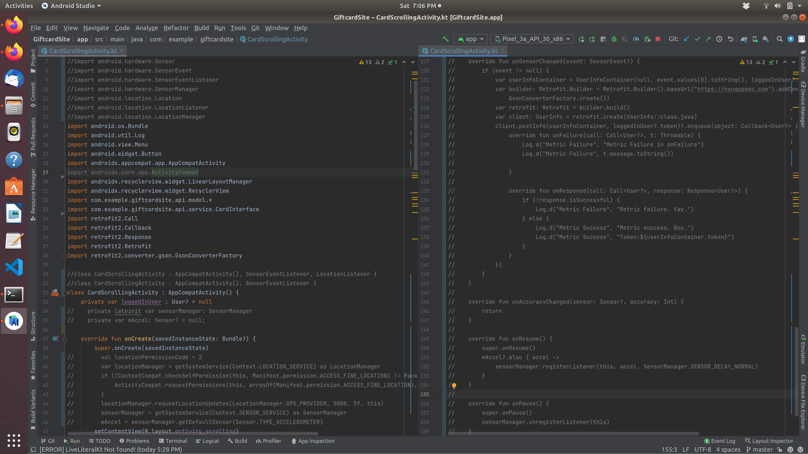
3. We see similar code in the file ```ProductScrollingActivity.kt``` and do the same changes as in step 2.
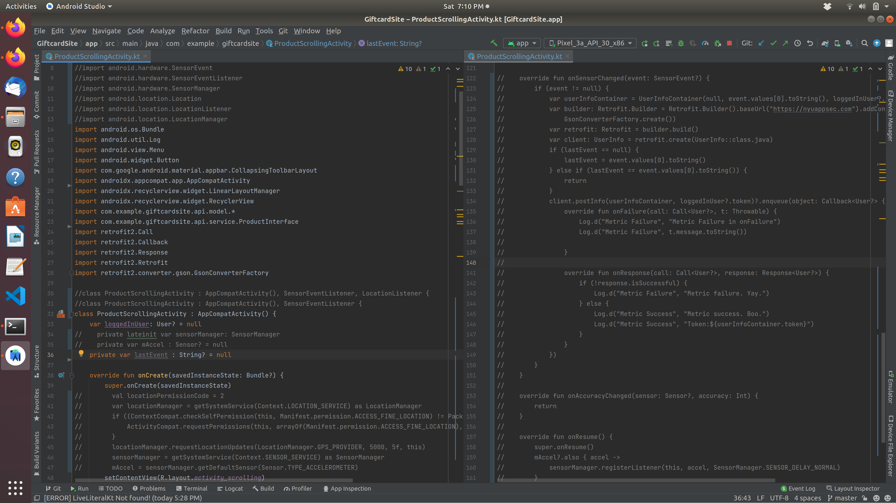
4. In the file ```Reporter.kt```, we remove the sensor package imports, onAccuracyChanged and onSensorChanged methods. Then we modify the class definition to not include sensor parameter.
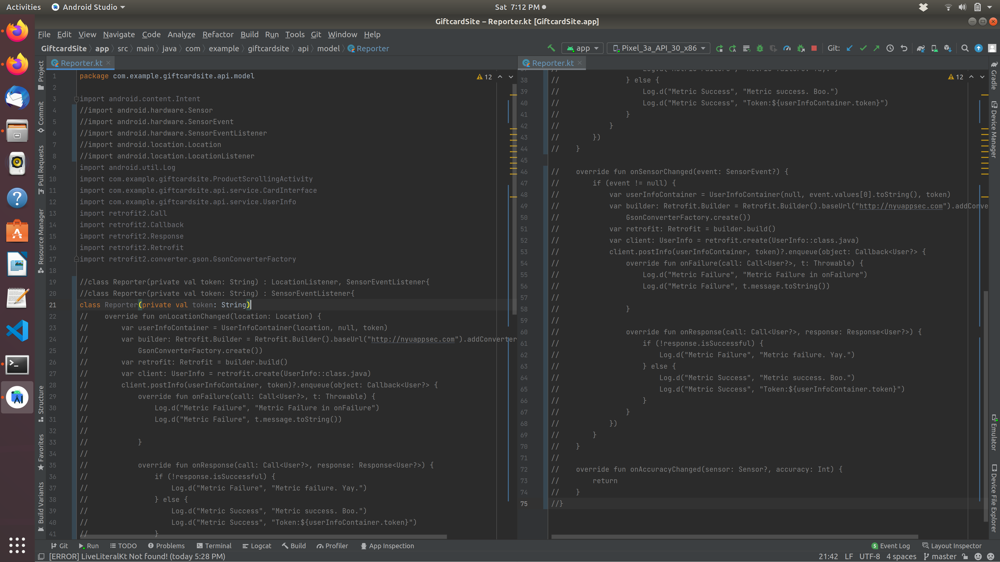

Then we apply changes and restart the app to check if the app runs without failing. This is shown below.

